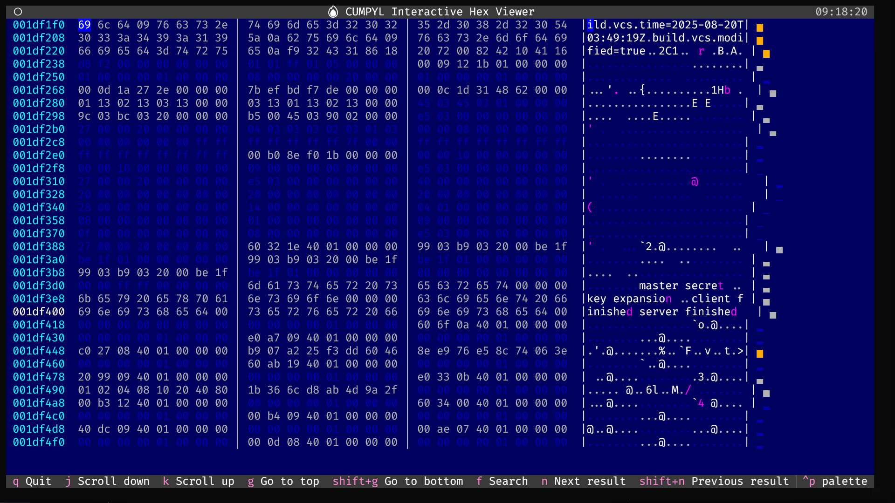
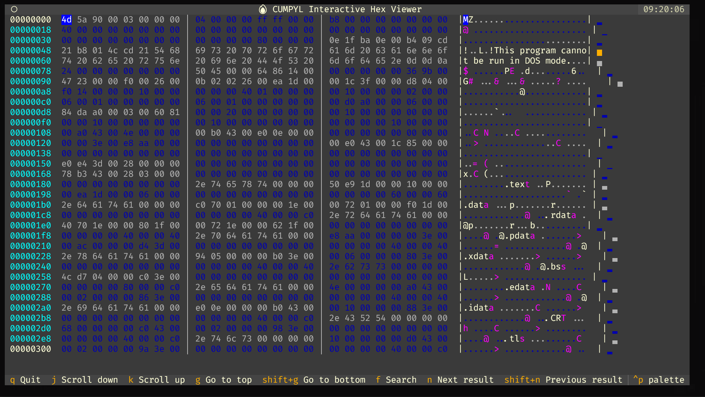

# Cumpyl - Binary Analysis & Rewriting Framework

[](https://github.com/umpolungfish/cumpyl)
[](https://python.org)
[](LICENSE)
[](https://github.com/umpolungfish/cumpyl/actions/workflows/ci.yml)
[](https://umpolungfish.github.io/cumpyl/)



Cumpyl is a Python-based binary analysis framework for analyzing, modifying, and rewriting binary files (PE, ELF, Mach-O). It features plugin architecture, batch processing, and comprehensive reporting capabilities.



## Quickstart — Command Line Ready

```bash
# Clone and install (recommended via uv)
git clone https://github.com/umpolungfish/cumpyl-framework
cd cumpyl-framework
uv sync --extra dev --extra test
source .venv/bin/activate  # Windows: .venv\Scripts\activate

# Or the traditional way
pip install -e ".[dev,test]"
```

```bash
# Launch interactive menu for guided binary analysis
cumpyl sample.bin --menu
```

```bash
# Quick commands:
cumpyl analyze file.exe                     # default analysis + report
cumpyl view firmware.bin --theme tokyo-night  # hex viewer with entropy and theme
cumpyl analyze sample.elf --report json > report.json
cumpyl analyze ./bins/*.elf --report html --output ./reports/
```

## Key Features

- **Plugin Architecture**: Dynamic plugin discovery with standardized interfaces
- **Multi-Format Support**: Native support for PE, ELF, and Mach-O binaries
- **Dual-Mode Hex Viewer**: Terminal TUI viewer (NEW!) + traditional browser-based hex dumps
- **Interactive Terminal Interface**: Full-featured TUI hex viewer with vim-like controls and real-time search
- **Batch Processing**: Multi-threaded processing with configurable worker pools
- **Comprehensive Reporting**: HTML, JSON, YAML, and XML report generation
- **YAML Configuration**: Centralized configuration with predefined analysis profiles
- **Rich Console Interface**: Color-coded output with progress indicators

## Installation

### Modern Installation (Recommended with uv)

```bash
# Install uv package manager
curl -LsSf https://astral.sh/uv/install.sh | sh

# Clone and install
git clone https://github.com/umpolungfish/cumpyl.git
cd cumpyl
uv sync  # Creates virtual environment and installs all dependencies

# Activate environment
source .venv/bin/activate  # Windows: .venv\Scripts\activate
```

### Traditional Installation

#### Using Conda/Mamba

```bash
mamba create -n cumpyl -c conda-forge python=3.9
mamba activate cumpyl
pip install lief capstone keystone-engine rich tqdm pyyaml textual
pip install -e .
```

#### Using pip

```bash
python -m venv cumpyl-env
source cumpyl-env/bin/activate  # Windows: cumpyl-env\Scripts\activate
pip install lief capstone keystone-engine rich tqdm pyyaml textual
pip install -e .
```

### Development Setup

#### With uv (Recommended)
```bash
uv sync --extra dev --extra test
python -m pytest tests/
```

#### Traditional
```bash
pip install -e ".[dev,test]"
python -m pytest tests/
cumpyl --show-config
```

## Quick Start


## Interactive Menu System


Cumpyl features a rich interactive menu system that provides guided access to all framework capabilities through an intuitive console interface. Launch the menu system with the `--menu` flag:


```bash

cumpyl binary.exe --menu

# or for batch operations

cumpyl --menu

```


### Main Menu Options


1. **🔍 Quick Analysis**: Fast section analysis and obfuscation suggestions

2. **🧪 Deep Analysis**: Comprehensive plugin-based analysis with reporting

3. **🔧 Interactive Hex Viewer**: Explore binary with interactive hex dump

4. **⚡ Batch Processing**: Process multiple files with automated workflows

5. **🎯 Encoding Operations**: Obfuscate specific sections with various encodings

6. **📊 Generate Reports**: Create detailed analysis reports in multiple formats

7. **⚙️ Configuration**: View and modify framework settings

8. **📁 Change Target**: Select a different binary file

9. **❓ Help**: Show detailed help and examples

10. **🚪 Quit**: Exit the menu system


### Quick Analysis Menu


- **Section Analysis Only**: Analyze binary structure and sections

- **Obfuscation Suggestions**: Get intelligent section encoding recommendations

- **Both Analysis + Suggestions**: Combined analysis and suggestions

- **With Basic Hex View**: Analysis with integrated hex viewer


### Deep Analysis Menu


- **Plugin Analysis Only**: Run all loaded plugins on the target binary

- **Analysis + HTML Report**: Plugin analysis with HTML report output

- **Analysis + JSON Report**: Plugin analysis with JSON report output

- **Full Workflow + Hex View**: Complete analysis with hex viewer

- **Malware Analysis Profile**: Preconfigured malware-focused analysis

- **Forensics Profile**: Preconfigured forensics-focused analysis


### Interactive Hex Viewer Menu

#### 🖥️ Terminal-based Interactive Hex Viewer (NEW!)

- **Interactive Terminal Hex Viewer**: Full TUI experience with real-time navigation
  - **Vim-like Controls**: j/k/g/G for smooth scrolling
  - **Live Search**: Search hex bytes or strings with instant highlighting  
  - **Color-coded Annotations**: Sections (blue), strings (green), entropy (yellow), suggestions (red)
  - **Real-time Analysis Integration**: Plugin results and obfuscation suggestions
  - **Performance Optimized**: Smooth rendering with configurable limits

#### 🌐 HTML-based Hex Viewer (Traditional)

- **Basic Hex View**: Generate static hex dump with analysis annotations

- **Interactive Section Selection**: Choose specific sections to view

- **Hex + Full Analysis**: Hex view with comprehensive binary analysis

- **Custom Range**: Specify custom byte ranges for viewing

- **View Specific Section**: Focus on a particular binary section

- **Large File View**: Optimized view for large binary files


### Batch Processing Menu


- **Process Directory**: Analyze all binaries in a specified directory

- **Pattern-based Processing**: Process files matching glob patterns

- **Multi-operation Batch**: Apply multiple operations to files

- **Custom Batch Job**: Build custom batch processing command


### Encoding Operations Menu


- **Encode Single Section**: Apply encoding to one binary section

- **Encode Multiple Sections**: Apply encodings to multiple sections

- **Custom Range Encoding**: Encode specific byte ranges

- **Batch Section Encoding**: Encode sections across multiple files


### Report Generation Menu


- **HTML Report**: Generate styled HTML analysis report

- **JSON Report**: Generate machine-readable JSON report

- **YAML Report**: Generate human-readable YAML report

- **XML Report**: Generate structured XML report

- **Custom Report**: Configure custom reporting options


### Configuration Menu


- **Show Current Config**: Display active framework configuration

- **Validate Config**: Check configuration file for errors

- **List Available Profiles**: View predefined analysis profiles

- **Plugin Information**: Show loaded plugins and their status


The menu system provides copy-ready command suggestions for direct CLI usage, making it easy to transition from guided exploration to automated workflows.


### Basic Usage

```bash
# Analyze binary structure
cumpyl binary.exe --analyze-sections

# Get obfuscation recommendations
cumpyl binary.exe --suggest-obfuscation

# Generate interactive hex viewer
cumpyl binary.exe --hex-view

# Comprehensive analysis with interactive hex view
cumpyl binary.exe --hex-view --run-analysis --suggest-obfuscation

# Run comprehensive analysis with HTML report
cumpyl binary.exe --run-analysis --report-format html --report-output analysis.html
```

### Batch Processing

```bash
# Process directory with plugin analysis
cumpyl --batch-directory /samples --batch-operation plugin_analysis --report-format json

# Multi-pattern processing
cumpyl --batch-pattern "*.exe" --batch-pattern "*.dll" --batch-operation analyze_sections

# Recursive processing with custom extensions
cumpyl --batch-directory /dataset --batch-extensions ".exe,.dll" --batch-recursive
```

### Encoding Operations

```bash
# Encode specific sections
cumpyl binary.exe --encode-section .text --encoding base64 -o encoded.exe

# Multi-section encoding
cumpyl binary.exe --encode-section .text --encoding base64 --encode-section .data --encoding hex
```

## Configuration

Create a `cumpyl.yaml` configuration file:

```yaml
framework:
  version: "0.3.0"
  debug_mode: false
  verbose_logging: true
  max_file_size_mb: 100

plugins:
  enabled: true
  plugin_directory: "plugins"
  auto_discover: true
  entropy_analysis:
    enabled: true
    threshold: 7.5
  string_extraction:
    enabled: true
    min_length: 4

performance:
  enable_parallel_processing: true
  max_worker_threads: 4
  batch_size: 50

output:
  hex_viewer:
    enabled: true
    max_display_bytes: 2048
    color_scheme: "dark"
    auto_add_analysis_annotations: true

analysis_profiles:
  malware_analysis:
    plugins: ["entropy_analysis", "string_extraction"]
    safety_checks: true
  forensics:
    plugins: ["string_extraction"]
    safety_checks: true
```

### Configuration Commands

```bash
cumpyl --validate-config
cumpyl --show-config
cumpyl binary.exe --config custom.yaml --run-analysis
cumpyl binary.exe --profile malware_analysis --run-analysis
```

## Plugin Development

### Creating Custom Plugins

```python
# plugins/my_custom_plugin.py
from cumpyl_package.plugin_manager import PluginInterface
from typing import Dict, Any

class MyCustomPlugin(PluginInterface):
    @property
    def name(self) -> str:
        return "my_custom_plugin"
    
    @property
    def version(self) -> str:
        return "1.0.0"
    
    def analyze(self, rewriter) -> Dict[str, Any]:
        results = {
            "plugin_name": self.name,
            "binary_size": len(rewriter.binary.content) if rewriter.binary else 0,
        }
        return results
    
    def transform(self, rewriter, analysis_result: Dict[str, Any]) -> bool:
        return True

def get_plugin():
    return MyCustomPlugin()
```

### Available Plugins

- **Entropy Analysis**: Shannon entropy calculation for detecting packed/encrypted sections
- **String Extraction**: Pattern matching for URLs, emails, file paths with context scoring

## Console Features

### Tier System

- **Green (Advanced)**: Large, safe sections (.rdata, .rodata) - Recommended encodings: base64, hex
- **Yellow (Intermediate)**: Medium data sections - Recommended encodings: base64, compressed_base64  
- **Blue (Basic)**: Small sections - Recommended encodings: hex, octal
- **Red (Avoid)**: Critical sections (code, imports) - DO NOT OBFUSCATE

### Console Output

- Color-coded tier indicators
- Professional tables with styling
- Real-time progress feedback
- Copy-ready command suggestions
- Interactive progress bars

## Python API

```python
from cumpyl_package.cumpyl import BinaryRewriter
from cumpyl_package.config import ConfigManager

# Initialize with configuration
config = ConfigManager("config.yaml")
rewriter = BinaryRewriter("binary.exe", config)

# Load and analyze
if rewriter.load_binary():
    analysis_results = rewriter.run_plugin_analysis()
```

## Testing

```bash
python -m pytest tests/
python -m pytest tests/ --cov=cumpyl_package --cov-report=html
```

## Project Structure

```
cumpyl/
├── cumpyl_package/          # Core framework
│   ├── cumpyl.py           # Main binary rewriter
│   ├── config.py           # Configuration management
│   ├── plugin_manager.py   # Plugin architecture
│   ├── batch_processor.py  # Batch processing
│   ├── hex_viewer.py       # Interactive hex viewer
│   └── reporting.py        # Report generation
├── plugins/                 # Plugin ecosystem
├── tests/                   # Test suite
├── cumpyl.yaml             # Default configuration
└── setup.py                # Package configuration
```

## Dependencies

- [LIEF](https://lief.quarkslab.com/) - Binary parsing (PE, ELF, Mach-O)
- [Capstone](https://www.capstone-engine.org/) - Disassembly framework
- [Keystone](https://www.keystone-engine.org/) - Assembly framework
- [Rich](https://github.com/Textualize/rich) - Console formatting
- [PyYAML](https://pyyaml.org/) - Configuration parsing

## License

This project is released into the public domain under the [Unlicense](LICENSE).