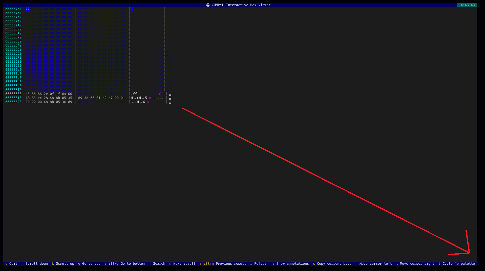

# Getting Started with Cumpyl

Cumpyl is a powerful Python-based binary analysis framework for analyzing, modifying, and rewriting binary files (PE, ELF, Mach-O).

## Installation

### Modern Installation (Recommended with uv)

```bash
# Install uv package manager
curl -LsSf https://astral.sh/uv/install.sh | sh

# Clone and install
git clone https://github.com/umpolungfish/cumpyl.git
cd cumpyl
uv sync  # Creates virtual environment and installs all dependencies

# Activate environment
source .venv/bin/activate  # Windows: .venv\Scripts\activate
```

### Traditional Installation

```bash
git clone https://github.com/umpolungfish/cumpyl.git
cd cumpyl
pip install -e .
```

## First Run

The easiest way to get started with Cumpyl is to use the interactive menu system:

```bash
cumpyl sample.exe --menu
```

This will launch a guided interface that provides access to all of Cumpyl's features:

1. **Quick Analysis**: Fast section analysis and obfuscation suggestions
2. **Deep Analysis**: Comprehensive plugin-based analysis with reporting
3. **Interactive Hex Viewer**: Explore binary with interactive hex dump
4. **Batch Processing**: Process multiple files with automated workflows
5. **Encoding Operations**: Obfuscate specific sections with various encodings
6. **Report Generation**: Create detailed analysis reports in multiple formats
7. **Configuration**: View and modify framework settings



The menu system provides copy-ready command suggestions for direct CLI usage, making it easy to transition from guided exploration to automated workflows.